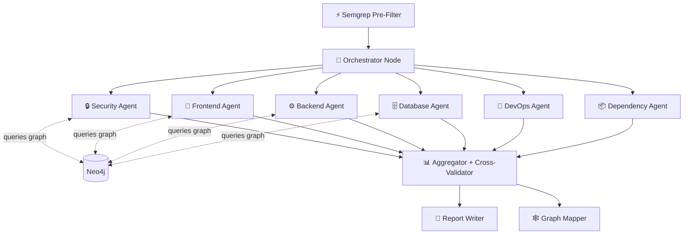
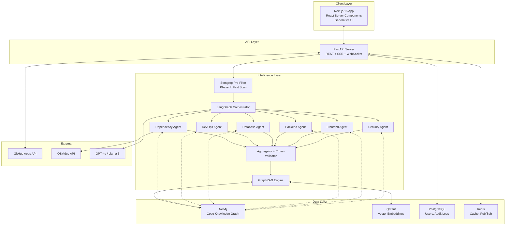

# Plexus — Comprehensive Research Document

> **Version:** 1.2 | **Date:** June 4, 2026 | **Status:** Research Complete
>
> This document is the product of 4 parallel deep-research investigations across 52 sub-topics.
> It covers every technology, feature, architecture decision, and differentiation strategy for Plexus.

---

## Table of Contents

1. [Executive Summary & Vision](#1-executive-summary--vision)
2. [How Plexus Differs from SPECTRA](#2-how-plexus-differs-from-spectra)
3. [Competitive Landscape Analysis](#3-competitive-landscape-analysis)
4. [Complete Feature Matrix](#4-complete-feature-matrix)
5. [Core Technology: GraphRAG Engine](#5-core-technology-graphrag-engine)
6. [Core Technology: Multi-Agent SPECTRA Pipeline](#6-core-technology-multi-agent-spectra-pipeline)
7. [Core Technology: Generative UI & Role-Based Dashboards](#7-core-technology-generative-ui--role-based-dashboards)
8. [Feature Deep-Dive: Blast Radius Visualization](#8-feature-deep-dive-blast-radius-visualization)
9. [Feature Deep-Dive: Semantic Time-Travel](#9-feature-deep-dive-semantic-time-travel)
10. [Feature Deep-Dive: Autonomous Remediation (Auto-Fix PRs)](#10-feature-deep-dive-autonomous-remediation-auto-fix-prs)
11. [Complete Tech Stack Decision Matrix](#11-complete-tech-stack-decision-matrix)
12. [System Architecture & Execution Pipeline](#12-system-architecture--execution-pipeline)
13. [Efficiency & Intelligence Optimizations](#13-efficiency--intelligence-optimizations)
14. [Vulnerability Scoring & Intelligence](#14-vulnerability-scoring--intelligence)
15. [Enterprise Deployment & Compliance](#15-enterprise-deployment--compliance)
16. [Business Model & Pricing Strategy](#16-business-model--pricing-strategy)
17. [Manual Human-Required Setup (AI Limitations)](#17-manual-human-required-setup-ai-limitations)
18. [Granular Step-by-Step Task Checklist](#18-granular-step-by-step-task-checklist)
19. [References & Sources](#19-references--sources)

---

## 1. Executive Summary & Vision

### What Is Plexus?

Plexus is an **enterprise-grade Developer Experience (DevEx) and Security Posture platform** that represents the evolutionary convergence of:

- **Parallel, multi-agent code auditing** (inspired by SPECTRA-class systems)
- **Relational knowledge retrieval** (GraphRAG — Graph-based Retrieval Augmented Generation)
- **Adaptive, role-based Generative UI**

By treating a codebase not as flat text but as a **living, interconnected graph of logic**, Plexus solves two of the most expensive problems in software engineering:

| Problem | Industry Cost | Plexus Solution |
|---------|--------------|----------------------|
| **New Developer Onboarding** | ~$30K–$50K per engineer in lost productivity | Semantic Time-Travel + Onboarding Quests |
| **Architectural Security Vulnerabilities** | ~$4.88M average cost per breach (IBM 2024) | GraphRAG Blast Radius + Multi-Agent Audit |

### Core Philosophy

> Standard LLMs and tools like GitHub Copilot operate on **localized context** (the file you are currently viewing). They fail at **systemic understanding**.

Plexus bridges this gap by combining:

| Dimension | Capability | What It Means |
|-----------|-----------|---------------|
| **Vertical Depth** | 6+ distinct AI agents attacking different stack layers simultaneously | Highly specific flaws found in security, frontend, backend, database, devops, dependencies |
| **Horizontal Breadth** | Functions, APIs, and schemas mapped into a Graph Database | Understand how a backend middleware vulnerability impacts a frontend React component |
| **Adaptive Delivery** | Generative UI that changes based on user role | Security Matrix for CISOs, Interactive Tutorials for Junior Devs, Velocity Metrics for CTOs |

### Tagline

> **"Plexus — The first AI-native code analysis platform that understands your code the way your best engineer does: through relationships, history, and context."**

---

## 2. How Plexus Differs from SPECTRA

> [!IMPORTANT]
> Plexus is **not a copy** of SPECTRA. SPECTRA is a CLI-based multi-agent auditing tool. Plexus is a **full-stack platform** that uses multi-agent auditing as one layer in a much larger architecture.

### Fundamental Architectural Differences

| Dimension | SPECTRA | Plexus |
|-----------|---------|-------------|
| **Core Concept** | Multi-agent code audit CLI | Enterprise DevEx + Security Posture **Platform** |
| **Interface** | CLI with PDF/MD reports | Full web application with Generative UI dashboards |
| **Code Understanding** | Flat text analysis per file | **Knowledge Graph** — code as interconnected nodes and relationships |
| **Retrieval** | None (direct LLM prompting) | **GraphRAG** — hybrid vector + graph retrieval for multi-hop reasoning |
| **Impact Analysis** | Per-file findings | **Blast Radius Visualization** — cross-service cascade mapping |
| **Historical Context** | None | **Semantic Time-Travel** — query git history in natural language |
| **Remediation** | Report only | **Auto-Fix PRs** — branches, applies fix, runs tests, submits PR |
| **User Targeting** | Single user (developer) | **Role-based** — CISO, Junior Dev, CTO each get different UI |
| **Deployment** | Local CLI tool | Cloud SaaS + Enterprise VPC + On-Prem |
| **LLM Strategy** | Cloud-only (OpenAI) | **Hybrid** — cloud (GPT-4o) + local (Llama 3 via vLLM) for data privacy |
| **CI/CD Integration** | None | **GitHub App** with webhook-driven continuous scanning |
| **Collaboration** | None | Real-time security team collaboration, shared annotations |
| **Compliance** | None | SOC2, ISO 27001, HIPAA compliance dashboards |

### What Plexus Borrows (Inspiration, Not Copying)

The **concept** of using multiple specialized AI agents for parallel code analysis is a well-established pattern in the AI/ML community (CrewAI, AutoGen, LangGraph all provide this). Plexus uses this pattern as one component, but wraps it in:

1. A **GraphRAG knowledge layer** that no CLI tool provides
2. A **full-stack web platform** with role-based generative UI
3. **Enterprise features** (VPC deployment, compliance, collaboration)
4. **Autonomous remediation** capabilities
5. **Historical code intelligence** via git history RAG

---

## 3. Competitive Landscape Analysis

### Enterprise Code Analysis Market Map

| Platform | Primary Focus | Strengths | Key Weakness |
|----------|--------------|-----------|-------------|
| **SonarQube** | Code quality + security via "Quality Gates" | Excellent tech debt tracking, LOC-based pricing | No SCA, no auto-remediation, no AI reasoning |
| **Snyk** | Developer-first SCA + SAST | Best-in-class vuln database, auto-fix PRs for deps | No code quality metrics, dependency-only fixes |
| **Veracode** | Enterprise AppSec + compliance | Unified SAST/DAST/SCA, binary analysis | Slow CI/CD integration, less developer-friendly |
| **Checkmarx** | End-to-end "code-to-cloud" | Comprehensive SAST/DAST/API/supply chain | Heavy, slower for daily dev workflows |
| **CodeClimate** | Engineering Intelligence (DORA) | Best for CTOs measuring delivery health | Not a security tool, management-focused |
| **DeepSource** | DevSecOps auto-reviews | AI-powered Autofix in PRs | Smaller ecosystem |
| **GitHub Copilot** | AI code assistant | Context-aware suggestions | Single-file context, no systemic understanding |

### What NO Competitor Currently Offers (Combined)

| Differentiator | Nearest Competitor | Plexus Advantage |
|---------------|-------------------|----------------------|
| **GraphRAG semantic code understanding** | None (all use pattern matching) | Multi-hop reasoning across code dependencies via knowledge graph |
| **Blast radius visualization** | Endor Labs (partial), Apiiro (partial) | Full interactive microservice impact mapping with cascade prediction |
| **Semantic time-travel** | None | Query git history in natural language, trace bug origins, identify domain experts |
| **Local+Cloud LLM hybrid** | None (all cloud-only) | Privacy-first architecture with vLLM on-prem + GPT-4o cloud routing |
| **Auto-fix PRs with full context** | Snyk (dependency-only), Copilot Autofix (single-file) | Graph-aware code-level fixes considering blast radius + historical patterns |
| **Unified quality+security+intelligence** | No single tool | Code quality (SonarQube) + Security (Snyk) + Engineering intel (CodeClimate) in one |
| **Role-based Generative UI** | None | CISO, CTO, Junior Dev each get dynamically generated interfaces |

> [!TIP]
> Plexus's unique positioning is at the intersection of **three categories** that are currently separate products: Code Quality (SonarQube), Application Security (Snyk/Checkmarx), and Engineering Intelligence (CodeClimate). No single tool combines all three with AI-native architecture.

---

## 4. Complete Feature Matrix

### 4.1 Core Analysis Features

| Feature | Description | Technology |
|---------|------------|-----------|
| **Multi-Agent Parallel Auditing** | 6+ specialist agents run simultaneously via LangGraph orchestration | LangGraph StateGraph + Send() API |
| **OWASP Top 10 Coverage** | Security Agent hunts for all OWASP categories | Semgrep rules + LLM reasoning |
| **Real CVE Lookup** | Cross-references dependencies against OSV.dev vulnerability database | OSV.dev batch API |
| **Weighted Severity Scoring** | Custom formula: CVSS (40%) + EPSS (30%) + Asset Criticality + Reachability | CVSS v4.0 + EPSS + CISA KEV |
| **AST-Based Code Parsing** | Multi-language Abstract Syntax Tree extraction | Tree-sitter (40+ languages) |
| **Static Analysis Integration** | Rule-based scanning with Semgrep, Bandit, ESLint | SARIF unified output format |

### 4.2 GraphRAG Intelligence Features

| Feature | Description | Technology |
|---------|------------|-----------|
| **Code Knowledge Graph** | Maps files, classes, functions, variables as nodes with CALLS/IMPORTS/INHERITS edges | Neo4j + tree-sitter AST |
| **Hybrid Retrieval** | Vector similarity + graph traversal for context-aware answers | Qdrant (vectors) + Neo4j (graph) |
| **Community Detection** | Hierarchical clustering of code modules for architectural understanding | Leiden algorithm via graspologic |
| **Multi-Hop Reasoning** | Trace data flows across multiple files, services, and boundaries | Cypher queries + LLM synthesis |
| **Natural Language Querying** | "What calls the payment API?" → Cypher generation → graph traversal → answer | Text2Cypher + LLM |

### 4.3 Unique Differentiating Features

| Feature | Description | Technology |
|---------|------------|-----------|
| **Blast Radius Visualization** | Interactive graph showing every downstream service/API/component affected by a vulnerability | react-force-graph + D3 + Neo4j traversal |
| **Semantic Time-Travel** | Query git history: "Why did we switch from Redis to Memcached?" | GitPython + Vector DB + git blame RAG |
| **Auto-Fix PRs** | Branch repo, apply AST-level fix, run tests, submit human-readable PR | GitHub Apps API + Octokit |
| **Onboarding Quests** | Gamified sandbox tasks for junior devs to learn codebase architecture | Quest engine + GitHub API progress tracking |
| **Role-Based Generative UI** | CISO sees compliance matrices; Junior Dev sees tutorials; CTO sees velocity metrics | Vercel AI SDK + CASL permissions |

### 4.4 Enterprise Features

| Feature | Description | Technology |
|---------|------------|-----------|
| **Dual LLM Support** | Cloud (GPT-4o) + Local (Llama 3 via vLLM) for data sovereignty | Privacy-aware router + vLLM |
| **VPC Deployment** | Run entirely inside customer's AWS/GCP/Azure environment | Docker + Kubernetes + Helm |
| **Compliance Dashboards** | SOC2, ISO 27001, HIPAA compliance posture visualization | Tremor + Recharts |
| **Real-Time Collaboration** | Shared vulnerability annotations, comment threads, @mentions | SSE + Redis Pub/Sub |
| **CI/CD Integration** | Webhook-driven scanning on every push/PR | GitHub Apps + Checks API |
| **Audit Logging** | Immutable, centralized logs for compliance | Structured logging + SIEM integration |

### 4.5 Additional Advanced Features (Maximizing the Project)

| Feature | Description | Why It Matters |
|---------|------------|---------------|
| **Code Health Score** | Single 0-100 metric aggregating quality, security, debt, test coverage | Executive-friendly KPI |
| **Tech Debt Tracker** | Visualize debt accumulation over time with automated refactoring ROI | CTO decision-making |
| **SBOM Generation** | Software Bill of Materials for supply chain transparency | Regulatory compliance |
| **License Compliance** | Detect GPL/AGPL license conflicts in dependency tree | Legal risk mitigation |
| **Dead Code Detection** | Graph queries to find unreachable functions/classes | Codebase hygiene |
| **API Surface Mapping** | Auto-discover and document all API endpoints | Security boundary definition |
| **Change Coupling Analysis** | Identify files that always change together (hidden dependencies) | Architecture health |
| **Domain Expert Identification** | git blame analysis to identify who knows what | Onboarding acceleration |
| **Threat Modeling Assistant** | AI-generated STRIDE threat models based on architecture graph | Proactive security |
| **Custom Rule Engine** | User-defined analysis rules in YAML/Semgrep syntax | Enterprise customization |

---

## 5. Core Technology: GraphRAG Engine

### 5.1 What Is GraphRAG?

**GraphRAG** (Graph-based Retrieval Augmented Generation) was formalized by Microsoft Research in 2024 (paper: *"From Local to Global: A Graph RAG Approach to Query-Focused Summarization"*, arXiv:2404.16130).

**Key Insight:** Traditional RAG breaks documents into independent chunks and retrieves by vector similarity. This fails for **systemic questions** like "What are the main architectural patterns?" or "How does this vulnerability cascade?" GraphRAG solves this by:

1. Extracting **entities and relationships** into a knowledge graph
2. Using **community detection** (Leiden algorithm) to find clusters
3. Generating **community summaries** for global understanding
4. Combining **vector search** (local) + **graph traversal** (global) at query time

### 5.2 GraphRAG vs Traditional RAG

| Feature | Traditional RAG (Vector) | GraphRAG |
|---------|------------------------|----------|
| **Data Structure** | Flat vector index (text chunks) | Knowledge graph (nodes + relationships) |
| **Context Type** | Isolated, semantically similar chunks | Connected, relational context |
| **Best For** | Fact retrieval, simple Q&A | Multi-hop reasoning, complex relationships |
| **Global Questions** | Struggles (can't "connect the dots") | Excels (community summaries span entire corpus) |
| **Explainability** | Limited (which chunks matched) | High (traceable graph paths) |
| **Setup Complexity** | Low | Higher (requires graph construction) |

> [!IMPORTANT]
> **The recommended approach is HYBRID** — use both vector search (speed, entry points) and graph reasoning (depth, synthesis). Plexus should implement both.

### 5.3 Applying GraphRAG to Source Code

#### Code Knowledge Graph Schema

```
Nodes:
  (File)           — source code files
  (Module)         — logical modules/packages
  (Class)          — classes/structs
  (Function)       — functions/methods
  (Variable)       — important variables/constants
  (APIEndpoint)    — REST/GraphQL endpoints
  (DatabaseTable)  — schema tables
  (Vulnerability)  — detected security issues

Edges:
  (Function)-[:CALLS]->(Function)
  (Class)-[:INHERITS_FROM]->(Class)
  (Module)-[:IMPORTS]->(Module)
  (Function)-[:BELONGS_TO]->(Class)
  (File)-[:CONTAINS]->(Function)
  (Function)-[:READS_FROM]->(DatabaseTable)
  (Function)-[:WRITES_TO]->(DatabaseTable)
  (APIEndpoint)-[:HANDLED_BY]->(Function)
  (Vulnerability)-[:AFFECTS]->(Function)
  (Vulnerability)-[:BLAST_RADIUS]->(APIEndpoint)
```

#### Two Approaches for Graph Construction

| Approach | Method | Accuracy | Speed |
|----------|--------|----------|-------|
| **AST-Derived** (Recommended) | Tree-sitter parses code → deterministic structural extraction | Very High | Fast |
| **LLM-Extracted** | LLM reads code → infers entities/relationships | Moderate | Slower |

**Recommendation:** Use AST-derived graphs for structural relationships (CALLS, IMPORTS, INHERITS) and LLM extraction for semantic relationships (PURPOSE, RELATED_TO, IMPLEMENTS_PATTERN).

#### GraphRAG Pipeline for Code

```
Phase 1: Ingestion
  ├── Clone/access repository
  ├── Walk file tree
  ├── Parse each file with tree-sitter → extract AST
  └── Extract entities (functions, classes, imports) + relationships (calls, inherits)

Phase 2: Graph Construction
  ├── Write entities as nodes in Neo4j
  ├── Write relationships as edges in Neo4j
  ├── Generate vector embeddings for function/class bodies → store in Qdrant
  └── Canonicalize entities (merge duplicates)

Phase 3: Community Detection
  ├── Run Leiden algorithm on the graph → identify clusters
  ├── Generate LLM summaries for each community
  └── Store summaries as "architectural overview" nodes

Phase 4: Hybrid Retrieval
  ├── Local Query: Vector search in Qdrant → find relevant functions → traverse Neo4j for context
  └── Global Query: Use community summaries → synthesize architectural answers
```

### 5.4 Graph Database Decision

| Database | Architecture | Best For | Key Advantage |
|----------|-------------|---------|---------------|
| **Neo4j** | Native graph, disk-based, Cypher | Enterprise production, complex governance | Mature ecosystem, LangChain/LlamaIndex integrations, hybrid vector+graph |
| **FalkorDB** | In-memory, Redis-based, GraphBLAS | Real-time AI, low-latency agents | Ultra-fast traversal, purpose-built for AI |
| **Memgraph** | In-memory, Cypher-compatible | High-performance, streaming | Good balance of speed and features |

> **Recommendation:** **Neo4j** for Plexus. It has the deepest enterprise ecosystem, built-in vector search, the `neo4j-graphrag` Python SDK, and native LangChain/LlamaIndex integrations. For latency-critical real-time features, consider FalkorDB as a secondary cache.

### 5.5 Vector Store Decision

| Database | Characteristics | Best For |
|----------|----------------|---------|
| **Qdrant** | Rust-based, high performance, advanced filtering | Production-grade hybrid search |
| **Pinecone** | Managed, highly scalable | Large-scale production, ease of management |
| **Weaviate** | Native hybrid search (keyword + vector) | Built-in knowledge graph integration |
| **ChromaDB** | "SQLite of vector databases" | Local dev, rapid prototyping |

> **Recommendation:** **Qdrant** for production (performance + self-hostable for enterprise VPC). **ChromaDB** for local development/testing.

### 5.6 Open-Source GraphRAG Frameworks

| Framework | Focus | Best For | GitHub |
|-----------|------|---------|--------|
| **Microsoft GraphRAG** | Depth & Reasoning | Complex multi-hop queries | github.com/microsoft/graphrag |
| **LightRAG** | Efficiency & Speed | Real-time, incremental updates | github.com/HKUDS/LightRAG |
| **Fast GraphRAG** | Scalability | Enterprise production, Personalized PageRank | github.com/circlemind-ai/fast-graphrag |
| **Graphiti (Zep AI)** | Temporal Knowledge Graphs | Dynamic agent memory, real-time updates | github.com/getzep/graphiti |
| **Nano-GraphRAG** | Learning & Customization | Research, lightweight (~1,100 lines) | github.com/gusye1234/nano-graphrag |

> **Recommendation:** Use **Microsoft GraphRAG** as the foundation, supplement with **Graphiti** for temporal awareness (tracking code changes over time). Use **Neo4j's `neo4j-graphrag` SDK** for the database integration layer.

### 5.7 Performance & Scaling

| Strategy | Description |
|----------|------------|
| **Incremental Updates** | Only re-index modified files (avoid full rebuild) |
| **Layered Caching** | Semantic cache for repeated queries; KV cache for LLM prompts |
| **Graph Partitioning** | Partition by module/service boundaries for large monorepos |
| **Two-Pass Retrieval** | Pass 1: High-level summaries → Pass 2: Detailed chunks for relevant sections |
| **Distributed Processing** | Ray/Dask for parallelizing embedding computation |
| **Cardinality Control** | Filter noisy, low-value entities to keep graph focused |

---

## 6. Core Technology: Multi-Agent SPECTRA Pipeline

### 6.1 LangGraph — The Orchestration Engine

LangGraph is built on **Pregel-style message passing**, organizing workflow execution into discrete "super-steps." It treats workflows as **cyclical graphs** where agents are nodes and transitions are edges.

#### Key Concepts

| Concept | Description |
|---------|------------|
| **StateGraph** | Core abstraction — define state schema as `TypedDict`, nodes as functions, edges as transitions |
| **Send() API** | Dynamic parallel fan-out — spawn parallel agent instances at runtime |
| **Reducers** | `Annotated[list, operator.add]` for automatic aggregation of parallel outputs |
| **Checkpointing** | `PostgresSaver` for production-grade durable state persistence |
| **Interrupts** | Human-in-the-loop via `interrupt()` for approval workflows |

#### Why LangGraph Over Alternatives

| Feature | **LangGraph** | CrewAI | AutoGen | Agency Swarm |
|---------|-------------|--------|---------|-------------|
| **Production Readiness** | **High** (Enterprise-grade) | Moderate | Moderate | Growing |
| **Native Parallelism** | **Yes** (Send API) | Limited | Via patterns | Via handoffs |
| **State Management** | **Built-in** (Postgres) | Basic | Session-based | Agent-local |
| **Determinism** | **High** (explicit graph) | Lower | Lower | Moderate |
| **Debugging** | **LangSmith/Studio** | Basic | Difficult | Basic |
| **Ecosystem** | **Massive** (LangChain) | Growing | Microsoft | OpenAI-aligned |

### 6.2 The 6 Specialist Agents



> [!NOTE]
> **Key optimizations visible in this diagram:**
> - **Semgrep Pre-Filter** runs before agents — flags suspicious code so agents focus on what matters (saves 60-80% LLM cost)
> - **Agents query Neo4j** during analysis — they can check "who calls this function?" to verify if a vulnerability is actually reachable
> - **Aggregator includes Cross-Validation** — deduplicates AND filters false positives in one step (not a separate agent)

#### Agent Specialization Details

| Agent | Files Targeted | What It Finds | Tools |
|-------|---------------|--------------|-------|
| **🔒 Security** | Auth, token, JWT, .env files | SQL injection, XSS, hardcoded secrets, broken auth, OWASP Top 10 | Semgrep `p/owasp-top-ten`, custom SAST |
| **🎨 Frontend** | .jsx, .tsx, .vue, .html, .css | Dangerous innerHTML, React memory leaks, stale closures, a11y issues | ESLint security plugins, tree-sitter JSX |
| **⚙️ Backend** | .py, .java, .go, .js server-side | Input validation flaws, unhandled exceptions, race conditions, business logic | AST analysis, pattern matching |
| **🗄️ Database** | .sql, ORM models, migrations/ | N+1 queries, missing indexes, destructive migrations, injection | SQL parsing, ORM pattern detection |
| **🐳 DevOps** | Dockerfile, docker-compose, CI/CD, K8s | Root containers, unpinned images, missing security policies | YAML/HCL parsing, config scanning |
| **📦 Dependency** | package.json, requirements.txt, go.mod | Known CVEs, unmaintained packages, license conflicts | OSV.dev API batch queries |

#### Agent Specialization Best Practices

1. **Dedicated system prompts** per agent with domain-specific expertise
2. **Scoped tool access** — each agent only gets tools relevant to its domain
3. **Structured JSON output schemas** — enforce consistent format for aggregation
4. **Confidence scoring** — each agent reports confidence level (0.0-1.0) with every finding
5. **AST-based smart chunking** — pass complete functions/classes (not arbitrary line splits) for better LLM understanding
6. **Graph-aware context** — agents query Neo4j mid-analysis to verify reachability and trace call chains
7. **Semgrep pre-hints** — agents receive Semgrep flags as hints, focusing LLM reasoning on suspicious areas
8. **Fallback/escalation** — agents flag low-confidence findings for human review

### 6.3 Agent Aggregation Pattern

```python
from typing import Annotated, TypedDict
import operator

class AnalysisState(TypedDict):
    code_files: dict[str, str]
    findings: Annotated[list[dict], operator.add]  # Auto-aggregated
    graph_updates: Annotated[list[dict], operator.add]
    summary: str

# Each agent returns:
# {"findings": [{"agent": "security", "severity": "HIGH",
#                "category": "A03:Injection", "issue": "SQL injection",
#                "file": "api/users.py", "line": 42, "confidence": 0.95}]}
```

### 6.4 Static Analysis Tool Integration

| Tool | Languages | Focus | Integration |
|------|-----------|-------|-------------|
| **Semgrep** | 30+ languages | Security + quality (most versatile) | `semgrep scan --config p/owasp-top-ten --json` |
| **Bandit** | Python only | Python security | `bandit -r target -f json` |
| **ESLint** | JS/TS | Quality + security plugins | `eslint target --format json` |

> **Recommendation:** Use **Semgrep as primary** — it can replace both Bandit and ESLint security plugins with unified rules. Output in **SARIF format** for cross-tool interoperability.

### 6.5 AST Parsing: Tree-sitter

**Tree-sitter** is the recommended parser (supports 40+ languages with one API):

| Feature | Python `ast` module | Tree-sitter |
|---------|-------------------|------------|
| **Scope** | Python only | 40+ languages |
| **Performance** | Good | Extremely fast, incremental |
| **Error Handling** | Strict | Error-tolerant (handles incomplete code) |
| **Best For** | Deep Python analysis | Cross-language tools |

```python
import tree_sitter_python as tspython
from tree_sitter import Language, Parser

PY_LANGUAGE = Language(tspython.language())
parser = Parser(PY_LANGUAGE)

tree = parser.parse(source_code_bytes)
query = PY_LANGUAGE.query("(function_definition name: (identifier) @func.name)")
captures = query.captures(tree.root_node)
```

**Installation:**
```bash
pip install tree-sitter tree-sitter-python tree-sitter-javascript tree-sitter-typescript tree-sitter-go tree-sitter-java
```

---

## 7. Core Technology: Generative UI & Role-Based Dashboards

### 7.1 Next.js 15 App Router Architecture

The frontend uses a **server-centric hybrid model**:

| Component Type | Purpose | JavaScript Shipped |
|---------------|---------|-------------------|
| **React Server Components (RSC)** | Data fetching, heavy logic, security-sensitive ops | Zero |
| **Client Components** | Browser interactivity (useState, useEffect, onClick) | Yes |
| **Server Actions** | Server-side mutations directly from UI | Zero |

#### Best Practices

- Keep `'use client'` as **low** in component tree as possible
- Fetch directly inside Server Components with `async/await`
- Validate Server Action inputs with **Zod** (treat as public endpoints)
- Use Route Handlers **only** for webhooks and machine-to-machine APIs

### 7.2 Vercel AI SDK — Generative UI

#### Current Best Practice (2026)

The dedicated `AI SDK RSC` library development was **paused**. Use:

1. **AI SDK UI** hooks (`useChat`) + **tool calling**
2. Server streams tool call data → client maps to React components
3. **json-render** (Vercel Labs): Forces AI to output structured JSON mapped to pre-defined component catalogs

#### Key Libraries

| Library | Purpose |
|---------|---------|
| **AI SDK v5/v6** | Core AI streaming, `streamText`/`streamObject`, `useChat` hook |
| **AI Elements** | Pre-built React components (message threads, reasoning panels) |
| **json-render** | Structured JSON → React component mapping with Zod schemas |

### 7.3 Role-Based Generative UI with CASL

**CASL** is the industry standard for declarative permission-based UI:

```jsx
// Define abilities per role
const ability = defineAbilityFor(currentUser);

// Use declaratively in components
<AbilityProvider value={ability}>
  <Can I="view" a="ComplianceDashboard">
    <ComplianceMatrix />
  </Can>
  <Can I="view" a="OnboardingQuests">
    <QuestTracker />
  </Can>
</AbilityProvider>
```

#### Three Dashboard Personas

| Persona | Dashboard Content | Key Components |
|---------|------------------|----------------|
| **CISO** | Compliance matrices (SOC2/ISO27001), severity scores, real-time threat maps, MTTR trends | Compliance gauges, risk heatmaps, audit logs |
| **Junior Dev** | Onboarding Quests, localized sandbox tasks, guided codebase exploration | Quest map, progress bars, interactive tutorials |
| **CTO** | Velocity metrics, tech debt accumulation, DORA metrics, refactoring ROI | Trend charts, cost projections, team analytics |

### 7.4 Interactive Graph Visualization

**`react-force-graph`** (2D/3D) is the standard for force-directed graphs in React:

```jsx
import ForceGraph2D from 'react-force-graph-2d';

const BlastRadiusGraph = ({ data, vulnerabilityId }) => {
  const [highlightNodes, setHighlightNodes] = useState(new Set());

  const calculateBlastRadius = (nodeId) => {
    // BFS/DFS traversal from affected node
    // Returns Set of all downstream node IDs
  };

  return (
    <ForceGraph2D
      graphData={data}
      nodeColor={node => highlightNodes.has(node.id) ? '#ff4444' : '#4488ff'}
      linkColor={link => highlightNodes.has(link.target) ? '#ff4444' : '#666'}
      onNodeClick={node => setHighlightNodes(calculateBlastRadius(node.id))}
      nodeCanvasObject={(node, ctx) => { /* Custom rendering */ }}
    />
  );
};
```

### 7.5 Real-Time Dashboard Updates (SSE)

**Server-Sent Events** are preferred over WebSockets for dashboards (unidirectional, simpler, auto-reconnect):

```typescript
// Server: app/api/events/route.ts
export async function GET(request: NextRequest) {
  const encoder = new TextEncoder();
  const stream = new ReadableStream({
    start(controller) {
      const interval = setInterval(() => {
        controller.enqueue(encoder.encode(`data: ${JSON.stringify(metrics)}\n\n`));
      }, 1000);
      request.signal.addEventListener('abort', () => {
        clearInterval(interval);
        controller.close();
      });
    },
  });
  return new Response(stream, {
    headers: { 'Content-Type': 'text/event-stream', 'Cache-Control': 'no-cache' },
  });
}
```

### 7.6 Monaco Editor for Code Viewing

```tsx
"use client";
import Editor from "@monaco-editor/react";

export default function CodeViewer({ code, language }) {
  return (
    <Editor
      height="50vh"
      defaultLanguage={language}
      defaultValue={code}
      theme="vs-dark"
      options={{ readOnly: true, minimap: { enabled: true } }}
    />
  );
}
```

### 7.7 Design System

| Element | Approach |
|---------|---------|
| **Dark Mode** | Deep charcoals (not pure black) + vibrant accent colors (neon green/pink) |
| **Glassmorphism** | Functional — semi-transparent blurred layers for nav, modals, pinned cards |
| **Typography** | Inter / Outfit from Google Fonts |
| **Layout** | Bento grids (asymmetric cards), modular/adaptive |
| **Animations** | Framer Motion (selective — hover effects, transitions, graph animations) |
| **Data Density** | "Five-Second Rule" — key insights grasped within 5 seconds |

---

## 8. Feature Deep-Dive: Blast Radius Visualization

### 8.1 Concept

When a vulnerability is detected (e.g., exposed JWT token, N+1 query), the GraphRAG engine **instantly calculates the Blast Radius** — every downstream microservice, API endpoint, and UI component affected by this specific flaw.

### 8.2 Graph Construction Sources

| Source | Method | What It Captures |
|--------|--------|-----------------|
| **Static analysis** | AST/CPG parsing (tree-sitter) | Code-level calls, imports, inheritance |
| **Distributed tracing** | OpenTelemetry/Zipkin | Runtime service-to-service communication |
| **SBOM** | Dependency manifests | First-party + third-party dependency tree |
| **Change Coupling** | Git history analysis | Services that frequently change together |

### 8.3 Blast Radius Calculation Algorithm

```
1. Build directed dependency graph (services as nodes, dependencies as edges)
2. For a given vulnerability, identify the affected node
3. Run forward reachability analysis (BFS/DFS from affected node)
4. Calculate fan-out score (how many services are downstream)
5. Apply reachability check (is the vulnerable code path actually invoked?)
6. Weight by business context:
   - Is it internet-facing?
   - Does it handle PII?
   - Is it revenue-critical?
7. Optional: Use Graph Neural Networks to predict cascade probability
```

### 8.4 Visualization Implementation

```
User clicks vulnerability → 
  Neo4j Cypher query calculates affected subgraph →
    react-force-graph renders interactive node graph →
      Color-coded risk levels (red/orange/yellow/green) →
        Click any node for service details + vulnerability info →
          Animation shows propagation paths
```

### 8.5 Mitigation Recommendations

The system can automatically suggest architectural mitigation patterns:

| Pattern | Description |
|---------|------------|
| **Bulkheading** | Partition resources to contain failures |
| **Circuit Breakers** | Stop cascading failures at service boundaries |
| **Rate Limiting** | Prevent overload propagation |
| **Input Validation** | Add validation at blast radius boundaries |

---

## 9. Feature Deep-Dive: Semantic Time-Travel

### 9.1 Concept

Instead of just reading the current code, the system **ingests Git commit history**. A developer can ask:

> *"Why did we choose Redis over Memcached for this caching layer two years ago?"*

The AI cross-references git blame, old PR comments, and the current code to provide the exact context.

### 9.2 Ingestion Pipeline

```
Step 1: Extraction
  ├── GitPython / Git CLI → extract commits (hash, author, timestamp, message, diffs)
  ├── Filter trivial commits ("fix typo", formatting-only)
  └── Chunk code changes using AST-based parsing

Step 2: Enrichment
  ├── LLM generates semantic summaries per commit
  ├── Classifies commits: Feature | Fix | Refactor | Security | Performance
  └── Extracts key decisions and rationale from commit messages + PR descriptions

Step 3: Storage
  ├── Vector DB (Qdrant/ChromaDB) → semantic similarity search on summaries
  ├── SQL/structured store → structured queries (by author, file, date range)
  └── Neo4j → temporal edges connecting code entities to commits

Step 4: git blame Integration
  └── Map every current line → last committer + commit context
```

### 9.3 Retrieval Pipeline

```
User query: "Why was the auth middleware rewritten last year?"
  ├── Vector search → find semantically similar commit summaries
  ├── SQL filter → narrow by date range + relevant files
  ├── git blame → identify who changed auth middleware + commit hashes
  ├── Re-ranking → LLM evaluates relevance of retrieved chunks
  └── Generation → LLM synthesizes answer with specific commit citations
```

### 9.4 Use Cases

| Query Type | Example | Data Sources |
|-----------|---------|-------------|
| **Decision Archaeology** | "Why did we switch from REST to GraphQL?" | Commit messages, PR descriptions |
| **Domain Expert ID** | "Who is the expert on the payment module?" | git blame frequency analysis |
| **Bug Origin Tracing** | "When was the auth bypass introduced?" | git bisect + semantic search |
| **Architecture Evolution** | "How has the database schema evolved?" | Migration file history |
| **Pattern Recognition** | "Does this PR look similar to past security fixes?" | Historical pattern matching |

---

## 10. Feature Deep-Dive: Autonomous Remediation (Auto-Fix PRs)

### 10.1 Concept

Finding bugs is only half the battle. Plexus includes a **Write-Access Agent** that:

1. Branches the repository
2. Applies the fix to the AST (not just text replacement)
3. Runs internal tests
4. Submits a human-readable Pull Request detailing the exact fix and why it was made

### 10.2 GitHub App Architecture

```
Trigger (vulnerability scan) →
  Analysis (GraphRAG context + blast radius) →
    Fix Generation (LLM with full graph context) →
      Branch + Commit (GitHub API) →
        Run Tests (CI pipeline) →
          Create PR (with explanation)
```

### 10.3 Required GitHub App Permissions

| Permission | Level | Purpose |
|-----------|-------|---------|
| **Contents** | Read & Write | Create branches, commit changes |
| **Pull Requests** | Read & Write | Create/update PRs |
| **Checks** | Read & Write | Report scan results as check runs |
| **Metadata** | Read | Basic repo info |

### 10.4 Key API Calls

```javascript
// 1. Create branch
POST /repos/{owner}/{repo}/git/refs
  { "ref": "refs/heads/plexus/fix-{issue-id}", "sha": "{base-sha}" }

// 2. Commit changes (via octokit-plugin-create-pull-request)
// Handles branch + file changes + commit in one call

// 3. Create PR
POST /repos/{owner}/{repo}/pulls
  { "title": "🔒 Fix: SQL Injection in api/users.py",
    "body": "## Vulnerability\n...\n## Blast Radius\n...\n## Fix Applied\n...",
    "head": "plexus/fix-{issue-id}",
    "base": "main" }
```

### 10.5 Differentiator vs Competitors

| Tool | What It Auto-Fixes | Scope |
|------|-------------------|-------|
| **Snyk** | Dependency version bumps only | Package manifest |
| **Dependabot** | Dependency updates only | Package manifest |
| **GitHub Copilot Autofix** | Single-file suggestions | Current file |
| **Plexus** | **Graph-aware code-level fixes** with blast radius context + historical patterns | Cross-file, architecture-aware |

---

## 11. Complete Tech Stack Decision Matrix

### 11.1 Frontend Layer

| Technology | Purpose | Why This Choice |
|-----------|---------|----------------|
| **Next.js 15+** (App Router) | Full-stack React framework | RSC for performance, Server Actions for mutations, streaming |
| **TypeScript 5+** | Type safety | Industry standard for enterprise |
| **Tailwind CSS v4** | Utility-first styling | Requested in spec, rapid iteration |
| **shadcn/ui + Radix UI** | Component library | Source ownership, accessible by default |
| **Vercel AI SDK + json-render** | Generative UI | Streaming AI responses, structured component rendering |
| **CASL** (@casl/react) | Permission-based UI | Declarative role-based rendering |
| **TanStack Table v8** | Data grids | High-performance sort/filter/pagination |
| **React Hook Form + Zod** | Forms + validation | Type-safe, performant forms |
| **Recharts / Tremor** | Charts & analytics | Compliance dashboards, trend visualization |
| **react-force-graph-2d + D3** | Graph visualization | Blast radius, dependency graph rendering |
| **Motion** (Framer Motion) | Animations | Selective micro-animations, transitions |
| **@monaco-editor/react** | Code editor | In-browser code viewing with syntax highlighting |
| **Lucide React** | Icons | Consistent iconography |
| **TanStack Query** | Server state | Caching, deduplication, background refetching |

### 11.2 Backend / AI Layer

| Technology | Purpose | Why This Choice |
|-----------|---------|----------------|
| **Python 3.12+** | Agent orchestration | LangChain/LangGraph ecosystem, ML libraries |
| **LangGraph** | Multi-agent workflow | Best production readiness, native parallelism, checkpointing |
| **LlamaIndex** | GraphRAG pipeline | PropertyGraphIndex, Neo4j integration, hybrid retrieval |
| **Neo4j** | Graph database | Enterprise standard, Cypher, built-in vectors, massive ecosystem |
| **Qdrant** | Vector database | Rust-based performance, self-hostable, advanced filtering |
| **PostgreSQL** | Relational data | User accounts, audit logs, LangGraph checkpoints |
| **Redis** | Caching + Pub/Sub | Real-time events, semantic caching, session management |
| **FastAPI** | API server | Async Python, auto-docs, WebSocket/SSE support |

### 11.3 Analysis & Parsing Layer

| Technology | Purpose | Why This Choice |
|-----------|---------|----------------|
| **Tree-sitter** | Multi-language AST parsing | 40+ languages, incremental, error-tolerant |
| **Semgrep** | Static analysis (SAST) | 30+ languages, OWASP rules, SARIF output |
| **Bandit** | Python security scanning | Deep Python-specific security rules |
| **ESLint** | JS/TS quality + security | eslint-plugin-security for frontend code |
| **OSV.dev API** | CVE/vulnerability lookup | Free, comprehensive, batch queries |
| **CVSS v4.0 + EPSS** | Severity scoring | Industry-standard + exploitation probability |
| **GitPython** | Git history extraction | Commit parsing, blame, diff analysis |

### 11.4 LLM Inference Layer

| Technology | Purpose | Why This Choice |
|-----------|---------|----------------|
| **GPT-4o** (Cloud) | Primary reasoning | Best code understanding, tool calling |
| **Llama 3 70B/405B** (Local) | Privacy-sensitive analysis | Enterprise data sovereignty via vLLM |
| **vLLM** | Local LLM serving | Production-grade, PagedAttention, tensor parallelism |
| **Privacy Router** | Smart routing | PII detection (Microsoft Presidio) → route to local vs cloud |

### 11.5 Infrastructure Layer

| Technology | Purpose | Why This Choice |
|-----------|---------|----------------|
| **Docker** | Containerization | Portable deployment |
| **Kubernetes** | Orchestration | Auto-scaling, self-healing, enterprise on-prem |
| **Helm Charts** | Deployment config | Standardized K8s deployment |
| **GitHub Apps API** | CI/CD integration | Webhooks, Checks API, PR creation |
| **Prometheus + Grafana** | Observability | Metrics, alerting, dashboards |

### 11.6 Optional/Future: Go Parser

| Technology | Purpose | Why This Choice |
|-----------|---------|----------------|
| **Go (Golang)** | High-speed repo cloning + AST parsing | Millisecond parsing for massive enterprise repos |

> [!NOTE]
> The Go parser is optional for MVP. Tree-sitter in Python handles most repos well. Go is only needed for enterprise-scale monorepos (millions of files) where parsing speed becomes a bottleneck.

---

## 12. System Architecture & Execution Pipeline

### 12.1 High-Level Architecture



### 12.2 Execution Pipeline (7 Phases)

```mermaid
graph LR
    A["1. Ingestion<br/>(+ Incremental Diff)"] --> B["2. Graph<br/>Construction"]
    B --> C["3. Pre-Filter<br/>(Semgrep)"]
    C --> D["4. Parallel<br/>Audit"]
    D --> E["5. Aggregation<br/>+ Cross-Validation"]
    E --> F["6. Graph<br/>Mapping"]
    F --> G["7. UI<br/>Generation"]

    style A fill:#1e3a5f
    style B fill:#2d4a6f
    style C fill:#2d5a3f
    style D fill:#3d5a7f
    style E fill:#4d6a8f
    style F fill:#5d6a5f
    style G fill:#5d7a9f
```



#### Phase 1: Ingestion (+ Incremental Diff)
- GitHub webhook triggers the system (or manual upload)
- Repository cloned / accessed
- **On subsequent scans:** `git diff` identifies changed files only
- **Graph traversal** finds all functions affected by changes (callers, dependents)
- File tree walked, files categorized by extension/path
- **Result:** Only changed code + impacted code enters the pipeline (not the entire repo)

#### Phase 2: Graph Construction
- Tree-sitter parses each file → extracts AST
- **Smart chunking:** Code split by logical units (functions, classes) — not arbitrary line counts
- Entities (functions, classes, imports) written as Neo4j nodes
- Relationships (calls, inherits, depends_on) written as Neo4j edges
- Vector embeddings generated for function/class bodies → stored in Qdrant
- Leiden community detection clusters code into logical modules

#### Phase 3: Pre-Filter (Semgrep — Fast, Free)
- **Semgrep runs first** with OWASP + security rules → flags suspicious code areas in milliseconds
- Clean code is marked as "low-priority" — agents skip it unless explicitly needed
- Flagged code gets priority routing to specialist agents with Semgrep hints attached
- **Impact:** Cuts LLM API costs by 60-80% while improving signal-to-noise ratio

#### Phase 4: Parallel Audit (SPECTRA Core — Graph-Aware)
- LangGraph spins up 6 specialist agents via `Send()` fan-out
- Each agent receives only relevant files (based on orchestrator routing + Semgrep flags)
- **Agents query Neo4j mid-analysis** to verify reachability ("Is this function actually called from a public endpoint?")
- Agents analyze code chunks, cross-reference OSV.dev for CVEs, check OWASP Top 10
- Each agent outputs findings with **confidence scores (0.0-1.0)** in structured JSON format

#### Phase 5: Aggregation + Cross-Validation
- Aggregator Node merges findings from all 6 agents
- **Cross-validation:** Checks if Semgrep agrees, if graph confirms reachability, if multiple agents flagged same issue
- Deduplicates issues found by multiple agents
- Filters false positives — boosts findings confirmed by multiple signals, downgrades unconfirmed ones
- Calculates severity scores (CVSS + EPSS + asset criticality + reachability + confidence)

#### Phase 6: Graph Mapping + Blast Radius
- Maps validated findings onto Neo4j graph
- Calculates blast radius for each vulnerability (BFS/DFS from affected node)
- Generates SARIF-format report for interoperability

#### Phase 7: UI Generation
- Next.js frontend queries Neo4j graph + aggregated findings
- CASL checks user role → renders appropriate dashboard
- Generative UI components stream based on user's queries
- Real-time updates via SSE as new findings arrive

---

## 13. Efficiency & Intelligence Optimizations

These are not "more agents." These are architectural decisions that make the existing 6 agents **smarter, faster, and cheaper** to run.

> [!IMPORTANT]
> These optimizations are what separate Plexus from being "another AI scanning tool" to being a **genuinely intelligent platform**. They directly impact cost, accuracy, and usability.

### 13.1 Two-Phase Analysis (Cheap → Expensive)

**Problem:** Sending all code to GPT-4o is expensive and wasteful. 80% of code is clean — the LLM wastes tokens confirming "no issues found."

**Solution:** Run Semgrep (free, instant) first. Only send flagged/suspicious code to LLM agents.

```
Phase 1: Semgrep scan (all code) → flags ~20% as suspicious → costs $0, takes seconds
Phase 2: LLM agents analyze ONLY flagged code → costs 80% less, better accuracy
```

| Approach | LLM Cost per Scan | Accuracy | Speed |
|----------|------------------|----------|-------|
| Send everything to GPT-4o | $$$$ | Good (noisy) | Slow |
| **Semgrep first → GPT-4o for flagged code** | **$** | **Better** (focused) | **Fast** |

**Why this matters:** At $0.01/1K tokens with GPT-4o, a 100K LOC repo costs ~$50-100 per full scan. With pre-filtering, that drops to ~$10-20. At enterprise scale (daily scans), this saves thousands per month.

### 13.2 Cross-Validation in Aggregator (Not a Separate Agent)

**Problem:** Every security tool produces false positives. Users lose trust, start ignoring findings.

**Solution:** The Aggregator node (already exists) gets cross-validation logic:

```python
def cross_validate_finding(finding, semgrep_results, graph_db):
    confidence = finding["agent_confidence"]  # Agent's self-assessment

    # Boost if Semgrep independently flagged the same location
    if semgrep_also_flagged(finding, semgrep_results):
        confidence = min(confidence + 0.15, 1.0)

    # Boost if Neo4j confirms the vulnerable code is reachable from a public API
    if graph_confirms_reachable(finding, graph_db):
        confidence = min(confidence + 0.20, 1.0)

    # Downgrade if only one agent found it with low confidence
    if finding["confirming_agents"] == 1 and confidence < 0.5:
        finding["severity"] = downgrade(finding["severity"])

    finding["final_confidence"] = confidence
    return finding
```

**Result:** Findings confirmed by multiple signals (agent + Semgrep + graph reachability) get boosted. Unconfirmed findings get downgraded. Users see fewer, higher-quality alerts.

> [!NOTE]
> This is NOT a new agent. It's additional logic inside the existing Aggregator node. Zero extra LLM calls.

### 13.3 Graph-Aware Agents (Agents Query Neo4j During Analysis)

**Problem:** Without graph access, an agent finds "potential SQL injection" but can't tell if it's actually exploitable. It can't see who calls that function or if user input ever reaches it.

**Solution:** Give each agent a Neo4j query tool. During analysis, agents can ask:

| Agent Query | What It Learns | Impact on Finding |
|------------|---------------|------------------|
| "Who calls `processPayment()`?" | Called from public `/api/checkout` endpoint | Severity: MEDIUM → **CRITICAL** |
| "Does user input reach `db.execute()`?" | Input flows through 3 functions before reaching DB | Confirms real SQL injection |
| "Is `parseToken()` used anywhere?" | Dead code — no callers | Severity: HIGH → **INFO** (dead code) |

**Why this matters:** This is the entire point of building a knowledge graph. Without agent-graph integration, you have two disconnected systems. With it, agents can **prove** vulnerabilities are real — not just guess.

### 13.4 Incremental Analysis (Only Scan What Changed)

**Problem:** Re-scanning an entire repo on every PR takes 10-30 minutes and costs a lot. Nobody will adopt a tool that blocks their CI/CD pipeline for that long.

**Solution:** After the first full scan, subsequent scans use `git diff` + graph traversal:

```
First scan: Full repo → build complete graph → store all results (10-30 min)

Every PR after that:
  1. git diff → 5 files changed
  2. Graph query → 12 functions affected (including callers of changed functions)
  3. Re-analyze only those 12 functions → update graph
  4. Recalculate blast radius for any new/changed findings
  Total time: 30 seconds - 2 minutes
```

| Scan Type | Time | LLM Cost | Usable in CI/CD? |
|-----------|------|----------|------------------|
| Full repo every time | 10-30 min | $$$$ | ❌ No |
| **Incremental (changed + impacted)** | **30s - 2min** | **$** | **✅ Yes** |

**Why this matters:** This is what makes Plexus usable as a **daily tool** instead of a weekly audit. It's the difference between a product developers actually use and one they run once then forget.

### 13.5 AST-Based Smart Chunking

**Problem:** Most tools chunk code by line count (e.g., 500 lines per chunk). This arbitrarily splits functions and classes, confusing the LLM.

**Solution:** Since we already parse ASTs with tree-sitter, chunk by **logical code units**:

```
❌ Bad (line-based):   Lines 1-500, Lines 501-1000
   → Function split across two chunks, LLM misses context

✅ Good (AST-based):   Function A (complete), Class B (complete), Module C (complete)
   → LLM sees entire logical unit, understands purpose and flow
```

**Why this matters:** This is essentially free — we're already parsing the AST. Chunking by AST nodes instead of line counts gives agents complete, meaningful code units. Better input = better analysis.

### 13.6 Confidence Calibration

**Problem:** Most AI tools say "CRITICAL vulnerability found!" with no self-awareness about how sure they are.

**Solution:** Every finding includes a confidence score built from multiple signals:

```python
finding = {
    "issue": "SQL Injection in processQuery()",
    "severity": "CRITICAL",
    "agent_confidence": 0.85,       # Agent's self-assessment
    "semgrep_agrees": True,         # Static analysis confirms
    "graph_reachable": True,        # Graph proves exploitable path exists
    "confirming_agents": 2,         # Two agents flagged this independently
    "final_confidence": 0.95,       # Combined multi-signal confidence
}
```

| Signal | Confidence Boost | Why |
|--------|-----------------|-----|
| Agent self-assessment | Base score | LLM's own judgment |
| Semgrep independently flagged | +0.15 | Static analysis confirms |
| Graph proves reachable | +0.20 | Mathematical proof of exploitable path |
| Multiple agents agree | +0.10 per extra agent | Cross-validation |
| Low confidence + single agent | -0.20 (downgrade severity) | Likely false positive |

**Why this matters:** Users can filter by confidence. Teams can set policies like "only auto-create tickets for findings above 0.8 confidence." This builds trust in the tool.

### 13.7 Code Property Graph — CPG (Future / Phase 2)

> [!WARNING]
> This is marked as **Phase 2 / Future** because it adds compiler-level complexity. The existing AST + Neo4j graph covers ~80% of CPG's value for the MVP.

**What it is:** A Code Property Graph merges three graph types into one:

| Graph Type | What It Shows | Alone It Can... |
|-----------|---------------|------------------|
| AST (Abstract Syntax Tree) | Code structure | Find patterns |
| CFG (Control Flow Graph) | Execution paths | Find dead code |
| DFG (Data Flow Graph) | How data moves | Track tainted input → dangerous sink |
| **CPG (All 3 combined)** | **Everything** | **Prove user input reaches SQL query through 5 files** |

**Tool:** Joern (open-source CPG engine) — supports C/C++/Java/JS/Python.

**Why Phase 2:** Building a full CPG with data-flow tracking is essentially building a compiler. It's extremely powerful but adds months of complexity. The current architecture (AST parsing + Neo4j call graph + LLM reasoning) already catches most real vulnerabilities. CPG would take it from 80% → 95% coverage, which matters for enterprise customers paying $5K/month.

### Summary: Impact of All Optimizations

| Optimization | Cost Impact | Accuracy Impact | Speed Impact | Complexity to Build |
|-------------|------------|----------------|-------------|--------------------|
| Two-Phase Analysis | **-60-80% LLM cost** | +Better (less noise) | +Faster | Low |
| Cross-Validation | None (no extra LLM calls) | **+40-60% fewer false positives** | Negligible | Low |
| Graph-Aware Agents | Slight increase (graph queries) | **+Major (proves reachability)** | Slight overhead | Medium |
| Incremental Analysis | **-90% on subsequent scans** | Same | **10-30min → 30sec** | Medium |
| Smart Chunking | None | +Better (complete context) | None | Very Low (free) |
| Confidence Calibration | None | **+Trust and usability** | None | Low |
| CPG (Phase 2) | Moderate | +15% more coverage | Moderate overhead | **High** |

---

## 14. Vulnerability Scoring & Intelligence

### 14.1 Custom Weighted Risk Score Formula

```python
def calculate_risk_score(cvss_base, epss_score, in_cisa_kev,
                         asset_criticality, is_reachable):
    """
    Weighted risk score calculation.

    Args:
        cvss_base: float (0-10) — CVSS base score
        epss_score: float (0-1) — EPSS exploitation probability
        in_cisa_kev: bool — Is it in CISA Known Exploited Vulnerabilities?
        asset_criticality: float (0.5-2.0) — multiplier based on asset importance
        is_reachable: bool — Is the vulnerable code path actually reachable?

    Returns:
        float (0-100) — Normalized risk score
    """
    # Base severity (40% weight)
    severity_component = (cvss_base / 10) * 40

    # Threat intelligence (30% weight)
    threat_component = epss_score * 30

    # CISA KEV override (add 15 points if actively exploited)
    kev_bonus = 15 if in_cisa_kev else 0

    # Asset criticality multiplier
    raw_score = (severity_component + threat_component + kev_bonus) * asset_criticality

    # Reachability discount (50% reduction if not reachable)
    if not is_reachable:
        raw_score *= 0.5

    return min(raw_score, 100)
```

### 14.2 Severity Buckets

| Score Range | Severity | Action |
|------------|---------|--------|
| 85-100 | **CRITICAL** | Immediate remediation, auto-fix PR if possible |
| 65-84 | **HIGH** | Fix in current sprint |
| 40-64 | **MEDIUM** | Schedule for next sprint |
| 20-39 | **LOW** | Backlog |
| 0-19 | **INFO** | Awareness only |

### 14.3 Intelligence Data Sources

| Source | Purpose | API |
|--------|---------|-----|
| **CVSS Base Score** | Technical severity | NVD API: `services.nvd.nist.gov/rest/json/cves/2.0` |
| **EPSS** | Exploitation probability | `api.first.org/data/v1/epss` |
| **CISA KEV** | Known exploited vulns | `cisa.gov/known-exploited-vulnerabilities-catalog` |
| **OSV.dev** | Open source vuln data | `api.osv.dev/v1/query` (100 req/min) |

### 14.4 OWASP Top 10 Detection Matrix

| Category | Auto-Detection | Approach |
|----------|---------------|---------|
| **A01: Broken Access Control** | Moderate | Pattern match missing auth checks |
| **A02: Cryptographic Failures** | High | Flag MD5, SHA1, hardcoded keys |
| **A03: Injection** | Very High | Data-flow: trace input → dangerous sinks |
| **A04: Insecure Design** | Low | Requires threat modeling (human review) |
| **A05: Security Misconfiguration** | Moderate | Scan config files |
| **A06: Vulnerable Components** | High | OSV.dev API + npm audit + pip-audit |
| **A07: Auth Failures** | Moderate | Detect weak passwords, insecure sessions |
| **A08: Data Integrity** | Moderate | Insecure deserialization detection |
| **A09: Logging Failures** | Low/Moderate | Verify security event logging |
| **A10: SSRF** | Moderate/High | Trace user input → URL-fetching functions |

---

## 15. Enterprise Deployment & Compliance

### 15.1 Deployment Models

| Model | Control | Data Sovereignty | Best For |
|-------|---------|-----------------|---------|
| **SaaS** (Cloud Standard) | Vendor-managed | Low | Speed, standard workflows |
| **VPC/BYOC** | Shared (vendor software, customer infra) | High | Regulated industries |
| **On-Premises** | Full customer | Highest | Air-gapped, total control |

### 15.2 Hybrid LLM Architecture (Privacy-Aware Routing)

```
User Query →
  [Privacy Classifier (Microsoft Presidio)] →
    Sensitive (PII/proprietary code)? → Local LLM (Llama 3 via vLLM on customer GPU)
    Non-sensitive? → Cloud LLM (GPT-4o for maximum reasoning)
```

| Tool | Best For | K8s Ready? |
|------|---------|-----------|
| **vLLM** | Production-scale, high-throughput | Yes (industry standard) |
| **Ollama** | Prototyping, internal tools | Yes (simpler setup) |

> **Cost benefit:** Local compute handles ~70-80% of routine tasks (classification, summarization). Cloud tokens used only when advanced reasoning is needed.

### 15.3 Compliance Frameworks

| Framework | Focus | Required For | Priority |
|-----------|------|-------------|----------|
| **SOC 2 Type II** | Trust services (Security, Availability, Confidentiality) | US B2B enterprise sales | **Start here** |
| **ISO 27001** | Information Security Management System | International enterprises | Phase 2 |
| **HIPAA** | Protected Health Information | Healthcare vertical | Phase 3 |
| **GDPR** | EU personal data | EU customers | Phase 3 |
| **FedRAMP** | Federal cloud services | US Government | Phase 4 (12-24 months) |

### 15.4 Shared Technical Controls (Build Once)

| Control | Implementation |
|---------|---------------|
| **RBAC** | Role-based access for all users |
| **Encryption at Rest** | AES-256 |
| **Encryption in Transit** | TLS 1.3 |
| **Audit Logs** | Immutable, centralized, detailed |
| **Vulnerability Management** | Continuous scanning in CI/CD |
| **Secure SDLC** | Security checks embedded in pipeline |

### 15.5 Compliance Automation

Use **Vanta, Drata, or Secureframe** to automate evidence collection and continuous monitoring. One control can satisfy multiple frameworks (cross-framework mapping).

> [!TIP]
> Build compliance-by-design from day one — it is **5-10x cheaper** than retrofitting.

---

## 16. Business Model & Pricing Strategy

### 16.1 Target Market

Plexus is a **high-ticket B2B SaaS** targeting:
- **Mid-Market Tech Companies** (50-500 engineers)
- **Elite Development Agencies**
- **Enterprise DevSecOps Teams**

### 16.2 Pricing Tiers

| Tier | Price | Deployment | Features |
|------|-------|-----------|----------|
| **Free** | $0 | Cloud | 1 repo, basic scanning, limited GraphRAG queries |
| **Team** | $49/seat/month | Cloud | Full scanning, GraphRAG analysis, basic blast radius |
| **Business** | $99/seat/month | Cloud | Auto-fix PRs, semantic time-travel, compliance dashboards, priority support |
| **Enterprise VPC** | $5,000/month base + $50/seat | Customer VPC | On-prem deployment, local LLM, SSO/SAML, SLA, dedicated CSM |

### 16.3 AI-Specific Pricing Considerations

- Track usage via **analysis credits** (not just seats)
- Enterprise: Offer **annual commits** with drawdown models
- Provide real-time consumption dashboards to prevent bill shock
- Free tier drives bottom-up adoption within engineering teams

### 16.4 Competitor Pricing Reference

| Tool | Pricing Model | Range |
|------|--------------|-------|
| SonarQube | LOC-based annual | Custom |
| Snyk | Per-developer | $25-98/user/month |
| DeepSource | Per-user | ~$24/user/month |
| CodeClimate | Annual contracts | $25K-$75K+ |

---

## 17. Manual Human-Required Setup (AI Limitations)

While an AI agent can build, format, and structure the Plexus codebase, there are external administrative, hosting, and security steps that the human developer must handle manually. The AI agent cannot execute these actions due to sandbox constraints, lack of browser session access, or financial authorization requirements:

### 17.1 Account Registration & Subscription Setup
*   **LLM API Providers**: Register accounts with OpenAI (platform.openai.com) and Anthropic (console.anthropic.com) to obtain API keys (`OPENAI_API_KEY`, `ANTHROPIC_API_KEY`) and fund developer wallets.
*   **GitHub App Registry**: Register the GitHub App on the GitHub Developer portal. You must manually generate and download the private key file (`.pem`), generate the Client Secret, and set up the Webhook URL pointing to your deployment server.
*   **Database Cloud Accounts** (If not self-hosting via Docker):
    *   *Neo4j Aura*: Register for a Neo4j Aura account if you prefer a managed graph database in production.
    *   *Qdrant Cloud*: Create a Qdrant Cloud account for hosted vector storage.
*   **Hosting & Production Deployments**: Register and set up Vercel (for Next.js frontend), AWS/GCP/Azure accounts, and configure billing profiles.

### 17.2 Local Environment Preparation
*   **Installation of System Runtimes**: Install Docker Desktop (with Compose), Python 3.12+, and Node.js 20+ on your host operating system.
*   **Local System Environment Variables**: Manually copy `.env.example` to `.env` in both the backend and frontend directories, filling in the generated keys, secrets, and database passwords.
*   **SSL Certificates**: Generate local development SSL certificates (e.g., using `mkcert`) if testing HTTPS/webhook workflows locally.

### 17.3 Third-Party Auditing & Compliance Pipelines
*   **Compliance Services**: Register for SOC 2 evidence collectors (Vanta, Drata, Secureframe) and authorize read-only access to your cloud infrastructure.

---

## 18. Granular Step-by-Step Task Checklist

This section provides an atomic, step-by-step development checklist to implement Plexus end-to-end. Tasks are categorized by core systems rather than arbitrary phases, allowing for logical, sequential development.

### Task Group A: Local Infrastructure & Environment
*   [ ] **Task A1: Monorepo Project Init**
    *   Initialize git repository in the workspace root.
    *   Create base subdirectories: `/backend` and `/frontend`.
    *   Write root `.gitignore` to exclude env files, venv folders, node_modules, and IDE directories.
*   [ ] **Task A2: Database Services Setup (Docker Compose)**
    *   Configure `docker-compose.yml` with healthchecks for Qdrant, Neo4j, Redis, and PostgreSQL.
    *   Ensure APOC plugin is enabled for Neo4j.
    *   Configure volume mounts for data persistence.
*   [ ] **Task A3: Backend FastAPI Initialization**
    *   Create `backend/requirements.txt` with FastAPI, uvicorn, pydantic-settings, and baseline libraries.
    *   Set up FastAPI entrypoint (`backend/app/main.py`) with CORS middleware, config loading (dotenv), and health check endpoint.
*   [ ] **Task A4: Frontend Next.js Initialization**
    *   Run `create-next-app` to set up Next.js 15 inside `/frontend` with TypeScript, Tailwind CSS, and App Router.
    *   Install baseline UI dependencies: shadcn/ui, framer-motion, lucide-react, re-charts.

### Task Group B: AST Parsing & Code Ingestion Pipeline
*   [ ] **Task B1: Tree-sitter AST Parser Service**
    *   Create parser service (`backend/app/services/parser.py`) integrated with Tree-sitter.
    *   Configure grammar downloads for Python, JavaScript/TypeScript, SQL, and Go.
    *   Implement function/class extraction: parse source code files, identify start/end line bounds of each logical unit, and retrieve their bodies.
*   [ ] **Task B2: Smart Chunking Logic**
    *   Implement AST-based chunking service to output complete logical code entities rather than arbitrary line counts.
    *   Extract signatures, decorators, docstrings, and imports for each chunk.
*   [ ] **Task B3: Static Analysis Integration (Semgrep)**
    *   Set up Python wrapper to execute Semgrep CLI programmatically on targeted directories.
    *   Configure Semgrep with OWASP rulesets and output to JSON/SARIF format.
    *   Write mapping script to parse Semgrep outputs and tag suspicious functions/classes.

### Task Group C: Graph Construction & GraphRAG Engine
*   [ ] **Task C1: Neo4j Schema & Connection Driver**
    *   Write driver service in Python (`backend/app/core/neo4j_client.py`) utilizing the Neo4j Python SDK.
    *   Write base Cypher queries to create, update, and search nodes (`File`, `Module`, `Class`, `Function`, `Variable`) and relationships (`CALLS`, `IMPORTS`, `INHERITS_FROM`).
*   [ ] **Task C2: Code Knowledge Graph Generator**
    *   Write graph construction script that walks the AST-derived entities.
    *   Map imports to define `IMPORTS` edges between files/modules.
    *   Map call expressions to define `CALLS` edges between functions.
*   [ ] **Task C3: Vector Store (Qdrant) Integration**
    *   Initialize Qdrant client (`backend/app/core/qdrant_client.py`).
    *   Set up collection schemas with cosine similarity for code embeddings.
    *   Write service to generate vector embeddings (via OpenAI/local embedding model) of function bodies and store them with metadata pointers (file path, class name).
*   [ ] **Task C4: MS GraphRAG Community Summarizer**
    *   Configure MS GraphRAG library to run community detection (Leiden clustering) on the Neo4j graph.
    *   Implement the LLM pipeline to summarize code clusters (communities) and store summaries back as Neo4j nodes.
*   [ ] **Task C5: Hybrid Retrieval Pipeline**
    *   Combine local vector search (retrieve similar code chunks from Qdrant) with graph traversal (retrieve callers/dependents from Neo4j).
    *   Write the synthesis engine that takes a developer's question, fetches this hybrid context, and generates a structured answer.

### Task Group D: LangGraph Multi-Agent Audit Pipeline
*   [ ] **Task D1: LangGraph Orchestrator Node**
    *   Define LangGraph `StateGraph` and its `AnalysisState` schema.
    *   Write routing controller that accepts files list, filters them, and prepares `Send` payloads for parallel agents.
*   [ ] **Task D2: Specialist Agent Prompting & Tooling**
    *   Write system prompts and tools for each of the 6 specialist agents:
        *   🔒 **Security Agent**: Equipped with Semgrep hints parser.
        *   🎨 **Frontend Agent**: Scoped to JS/TS components.
        *   ⚙️ **Backend Agent**: Scoped to API routes & server logs.
        *   🗄️ **Database Agent**: Scoped to SQL migrations and ORM classes.
        *   🐳 **DevOps Agent**: Scoped to yaml configurations.
        *   📦 **Dependency Agent**: Connected to OSV.dev batch API.
*   [ ] **Task D3: Graph-Aware Agent Tools**
    *   Equip agents with Neo4j lookup tools so they can query callers/callees in real-time during analysis.
*   [ ] **Task D4: Aggregator & Cross-Validator Node**
    *   Implement aggregation reducer to gather finding outputs.
    *   Write the deduplication and cross-validation logic (boost confidence if Semgrep + Graph confirm finding).
*   [ ] **Task D5: Severity & Risk Scoring Engine**
    *   Implement weighted risk formula (CVSS + EPSS + Reachability + Criticality).
    *   Integrate OSV.dev and CISA KEV endpoints to fetch real threat-intel data.

### Task Group E: Git & Remediation Pipeline (Auto-Fix)
*   [ ] **Task E1: Git History Ingestion (Semantic Time-Travel)**
    *   Write Git extractor service using GitPython to pull commit message diffs, blame ranges, and author history.
    *   Index commit histories into Qdrant for natural language historical queries.
*   [ ] **Task E2: Write-Access GitHub App Setup**
    *   Generate and configure a GitHub App with permissions for repository contents, metadata, and checks.
    *   Implement webhooks backend to listen to push/PR events.
*   [ ] **Task E3: Auto-Fix AST Generator**
    *   Implement LLM service to rewrite vulnerable code blocks based on context.
    *   Ensure modifications preserve formatting using AST replacement tools.
*   [ ] **Task E4: Pull Request Creator**
    *   Write Git branching agent that closes repo, applies fix, commits, runs local validation tests, and uses Octokit/GitHub API to open a PR with detailed explanation markdown.

### Task Group F: Frontend Dashboards & Generative UI
*   [ ] **Task F1: Generative UI Layout & Vercel AI SDK Integration**
    *   Configure Next.js page to hook into FastAPI stream endpoints via `useChat`.
    *   Map structured JSON outputs into premium UI components (reasoning panels, vulnerability cards, interactive logs).
*   [ ] **Task F2: Persona Dashboards**
    *   Set up role management with CASL permissions.
    *   **CISO Dashboard**: Real-time compliance heatmaps, score dials (Tremor/Recharts).
    *   **Junior Dev Dashboard**: "Onboarding Quests" panel mapping codebase paths.
    *   **CTO Dashboard**: Code Health trends and tech debt tracking graph.
*   [ ] **Task F3: Force-Directed Blast Radius Visualizer**
    *   Configure `react-force-graph-2d` component.
    *   Map Neo4j subgraph responses (nodes, edges) to render network nodes.
    *   Implement node highlight on click to show propagation blast radius.

### Task Group G: Enterprise Deployment, Routing, & Verification
*   [ ] **Task G1: Privacy-Aware Router (Dual LLM support)**
    *   Integrate Microsoft Presidio to detect credentials/PII in outgoing LLM prompts.
    *   Write routing controller: redirect sensitive requests to local vLLM/Ollama instance; send general queries to GPT-4o.
*   [ ] **Task G2: End-to-End Verification Pipeline**
    *   Write integration test script scanning a sample target repo (with known flaws like SQLi, dependency vulnerabilities).
    *   Validate that all 6 agents execute, findings are aggregated, blast radius is computed, and a SARIF report is exported.
*   [ ] **Task G3: Joern CPG Integration (Future/Phase 2)**
    *   Integrate Joern parser container to generate Control Flow and Data Flow Graphs for deeper validation sinks.

---

## 19. References & Sources

### Papers & Research
- Microsoft GraphRAG: [arXiv:2404.16130](https://arxiv.org/abs/2404.16130) — *"From Local to Global: A Graph RAG Approach to Query-Focused Summarization"*
- OWASP Top 10: [owasp.org/www-project-top-ten](https://owasp.org/www-project-top-ten/)
- CVSS v4.0: [first.org/cvss/v4.0/specification-document](https://www.first.org/cvss/v4.0/specification-document)
- EPSS: [first.org/epss](https://www.first.org/epss)

### Core Technologies
- LangGraph: [github.com/langchain-ai/langgraph](https://github.com/langchain-ai/langgraph)
- LlamaIndex: [docs.llamaindex.ai](https://docs.llamaindex.ai/)
- Neo4j: [neo4j.com](https://neo4j.com)
- Neo4j GraphRAG SDK: [pypi.org/project/neo4j-graphrag](https://pypi.org/project/neo4j-graphrag/)
- Qdrant: [qdrant.tech](https://qdrant.tech/)
- Tree-sitter: [tree-sitter.github.io](https://tree-sitter.github.io/tree-sitter/)
- Semgrep: [semgrep.dev](https://semgrep.dev/)

### GraphRAG Frameworks
- Microsoft GraphRAG: [github.com/microsoft/graphrag](https://github.com/microsoft/graphrag)
- LightRAG: [github.com/HKUDS/LightRAG](https://github.com/HKUDS/LightRAG)
- Fast GraphRAG: [github.com/circlemind-ai/fast-graphrag](https://github.com/circlemind-ai/fast-graphrag)
- Graphiti: [github.com/getzep/graphiti](https://github.com/getzep/graphiti)
- Nano-GraphRAG: [github.com/gusye1234/nano-graphrag](https://github.com/gusye1234/nano-graphrag)

### Frontend Technologies
- Next.js: [nextjs.org/docs](https://nextjs.org/docs)
- Vercel AI SDK: [ai-sdk.dev](https://ai-sdk.dev/)
- json-render: [json-render.dev](https://json-render.dev/)
- shadcn/ui: [ui.shadcn.com](https://ui.shadcn.com/)
- CASL: [casl.js.org](https://casl.js.org/)
- react-force-graph: [npmjs.com/package/react-force-graph-2d](https://www.npmjs.com/package/react-force-graph-2d)
- Motion (Framer): [motion.dev](https://motion.dev/)
- Monaco Editor: [npmjs.com/package/@monaco-editor/react](https://www.npmjs.com/package/@monaco-editor/react)
- Tremor: [tremor.so](https://tremor.so/)

### Vulnerability Intelligence
- OSV.dev: [osv.dev](https://osv.dev/) / [API docs](https://google.github.io/osv.dev/docs/)
- NVD: [nvd.nist.gov](https://nvd.nist.gov/)
- CISA KEV: [cisa.gov/known-exploited-vulnerabilities-catalog](https://www.cisa.gov/known-exploited-vulnerabilities-catalog)
- EPSS API: [api.first.org/data/v1/epss](https://api.first.org/data/v1/epss)

### Agent Orchestration Alternatives
- CrewAI: [github.com/joaomdmoura/crewAI](https://github.com/joaomdmoura/crewAI)
- AutoGen: [github.com/microsoft/autogen](https://github.com/microsoft/autogen)
- Agency Swarm: [github.com/VRSEN/agency-swarm](https://github.com/VRSEN/agency-swarm)

### Enterprise & Infrastructure
- vLLM: [docs.vllm.ai](https://docs.vllm.ai/)
- Microsoft Presidio (PII): [github.com/microsoft/presidio](https://github.com/microsoft/presidio)
- GitHub Apps: [docs.github.com/apps](https://docs.github.com/en/apps)
- Vanta (Compliance): [vanta.com](https://vanta.com/)

---

> **Document compiled from 4 parallel research investigations covering 52 sub-topics with extensive web research.**
>
> **Next step:** Review this document and approve the implementation plan. Then we can begin building Plexus.
